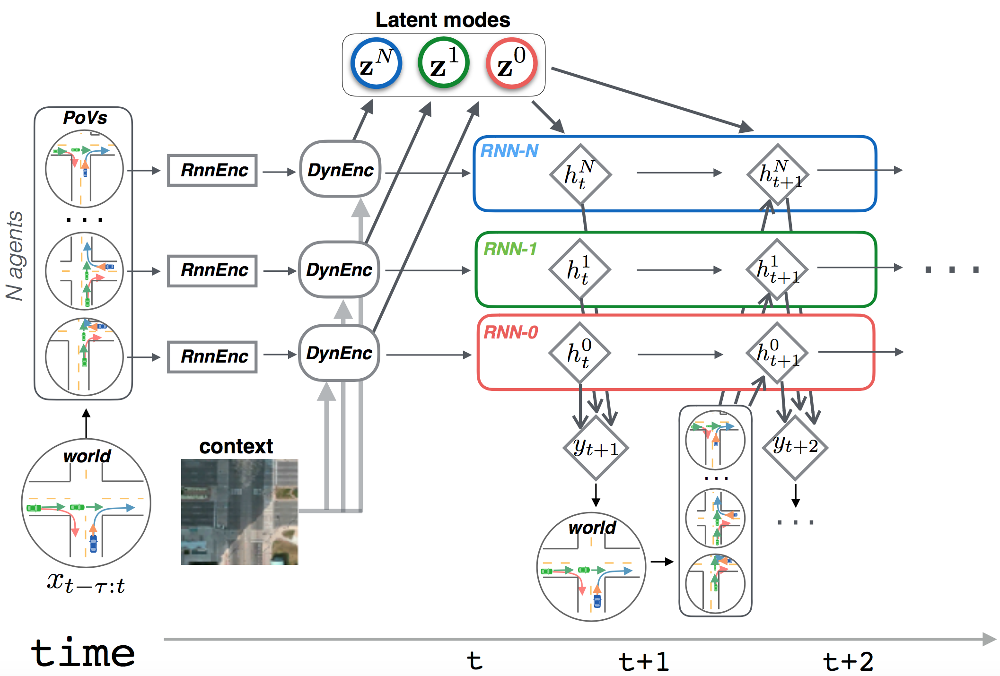

# Multiple Futures Prediction
## Paper
This software accompanies the paper [**Multiple Futures Prediction**](https://arxiv.org/abs/1911.00997). ([Poster](multiple_futures_prediction/assets/imgs/neurips_mfp_poster.pdf))<br>
[Yichuan Charlie Tang](https://www.cs.toronto.edu/~tang) and Ruslan Salakhutdinov<br>
Neural Information Processing Systems, 2019. (NeurIPS 2019)


Please cite our paper if you find our work useful for your research:
```
@article{tang2019mfp,
  title={Multiple Futures Prediction},
  author={Tang, Yichuan Charlie and Salakhutdinov, Ruslan},
  booktitle={Advances in neural information processing systems},
  year={2019}
}
```

## Introduction
Multiple Futures Prediction (MFP) is a framework for learning to forecast or predict future trajectories of agents, such as vehicles or pedestrians. A key feature of our framework is that it is able to learn multiple modes or multiple possible futures, by learning directly from trajectory data without annotations. Multi-agent interactions are also taken into account and the framework scales to an arbitrary number of agents in the scene by using a novel dynamic attention mechanism. It currently achieves state-of-the-art results on three vehicle forecasting datasets.

This research code is for demonstration purposes only. Please see the paper for more details.

### Overall Architecture
<p align="center">


The Multiple Futures Prediction (MFP) architecture is shown above. For an arbitrary number of agents in the scene, we first use RNNs to encode their past trajectories into feature vectors. Dynamic attentional contextual encoding aggregates interactions and relational information. For each agent, a distribution over its latent modes are then predicted. You can think of the latent modes representing conservative/aggressive behaviors or directional (left vs. right turns) intentions. Given a distribution over the latent modes, decoding RNNs are then employed to decode or forecast future temporal trajectories. The MFP is a latent-variable graphical model and we use the EM algorithm to optimize the evidence lower-bound.


## Getting Started

### Prerequisites
This code is tested with Python 3.6, and PyTorch 1.1.0. Conda or Virtualenv is recommended.<br>
Use pip (recent version, e.g. 20.1) to install dependencies, for example:
```
python3.6 -m venv .venv # Create new venv
source ./venv/bin/activate # Activate it
pip install -U pip # Update to latest version of pip
pip install -r requirements.txt # Install everything
```

### Datasets

#### How to Obtain NGSIM Data:

1. Obtain NGSIM Dataset here (US-101 and I-80):<br>
(https://data.transportation.gov/Automobiles/Next-Generation-Simulation-NGSIM-Vehicle-Trajector/8ect-6jqj)
```
Specifically you will need these files:
US-101:
'0750am-0805am/trajectories-0750am-0805am.txt'
'0805am-0820am/trajectories-0805am-0820am.txt'
'0820am-0835am/trajectories-0820am-0835am.txt'

I-80:
'0400pm-0415pm/trajectories-0400-0415.txt'
'0500pm-0515pm/trajectories-0500-0515.txt'
'0515pm-0530pm/trajectories-0515-0530.txt'
```
2. Preprocess dataset with code from Nachiket Deo and Mohan M. Trivedi:<br> [Convolutional Social Pooling for Vehicle Trajectory Prediction.] (CVPRW, 2018)<br>
(https://github.com/nachiket92/conv-social-pooling)<br>

3. From the conv-social-pooling repo, run prepocess_data.m, this should obtain three files:<br>
TrainSet.mat, ValSet.mat, and TestSet.mat. Copy them to the ngsim_data folder.

### Usage

#### Training
```bash
train_ngsim --config multiple_futures_prediction/configs/mfp2_ngsim.gin
```
or
```bash
python -m multiple_futures_prediction.cmd.train_ngsim_cmd --config multiple_futures_prediction/configs/mfp2_ngsim.gin
```
Hyperparameters (e.g. specifying how many modes of MFP) can be specified in the .gin config files.

Expected training outputs:
```
Epoch no: 0 update: 99 | Avg train loss: 57.3198  learning_rate:0.00100
Epoch no: 0 update: 199 | Avg train loss: 4.7679  learning_rate:0.00100
Epoch no: 0 update: 299 | Avg train loss: 4.3250  learning_rate:0.00100
Epoch no: 0 update: 399 | Avg train loss: 4.0717  learning_rate:0.00100
Epoch no: 0 update: 499 | Avg train loss: 3.9722  learning_rate:0.00100
Epoch no: 0 update: 599 | Avg train loss: 3.8525  learning_rate:0.00100
Epoch no: 0 update: 699 | Avg train loss: 3.5253  learning_rate:0.00100
Epoch no: 0 update: 799 | Avg train loss: 3.6077  learning_rate:0.00100
Epoch no: 0 update: 899 | Avg train loss: 3.4526  learning_rate:0.00100
Epoch no: 0 update: 999 | Avg train loss: 3.5830  learning_rate:0.00100
Starting eval
eval  val_dl nll
tensor([-1.5164, -0.3173,  0.3902,  0.9374,  1.3751,  1.7362,  2.0362,  2.3008,
         2.5510,  2.7974,  3.0370,  3.2702,  3.4920,  3.7007,  3.8979,  4.0836,
         4.2569,  4.4173,  4.5682,  4.7082,  4.8378,  4.9581,  5.0716,  5.1855,
         5.3239])
```
Depending on the CPU/GPU available, it can take from one to two days to complete 
300K training updates on the NGSIM dataset and match the results in Table 5 of the paper.

## License
This code is released under the [LICENSE](LICENSE) terms.
